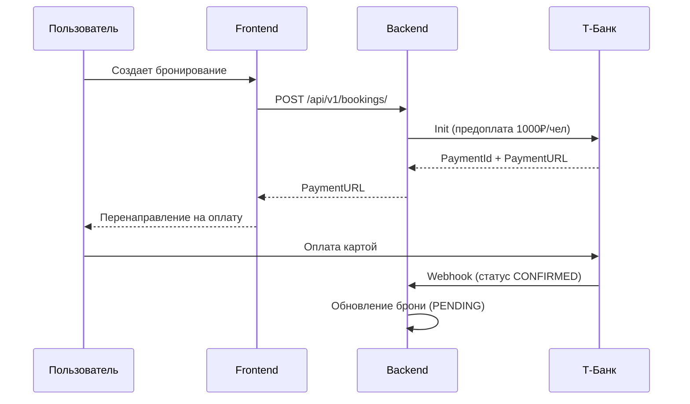
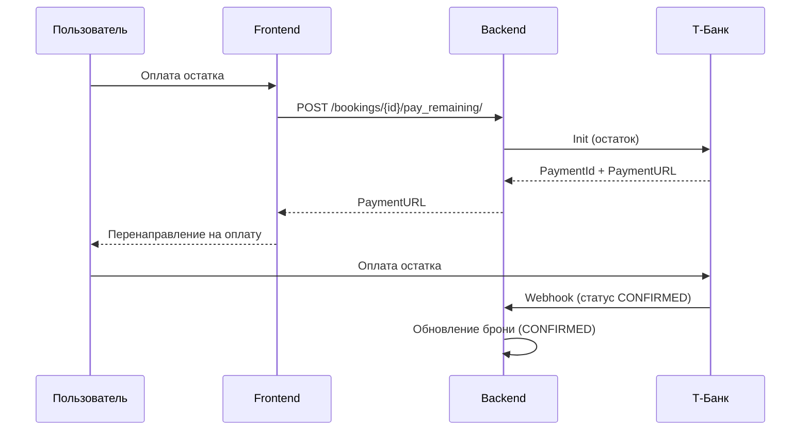

# Руководство по интеграции Т-Банка

## Обзор

Интеграция платежной системы Т-Банка для оплаты бронирований реализована через API эквайринга.

## Архитектура

### Backend (Django)

**Приложение `apps/payments`:**
- **models.py** - Модель `Payment` для хранения информации о платежах
- **services/tbank_service.py** - Сервис для работы с API Т-Банка
- **views.py** - ViewSet для управления платежами и webhook
- **serializers.py** - Сериализаторы для API

**Интеграция с бронированиями (`apps/bookings`):**
- Метод `create()` - автоматически инициирует платеж предоплаты
- Метод `pay_remaining()` - инициирует платеж остатка

### Frontend (React)

**Страницы:**
- `PaymentSuccess.jsx` - Страница успешной оплаты
- `PaymentFail.jsx` - Страница неудачной оплаты

**Обновленные компоненты:**
- `TripDetail.jsx` - Перенаправление на оплату при создании брони
- `Bookings.jsx` - Перенаправление на оплату остатка

## Настройка

### 1. Получение ключей

1. Зарегистрируйтесь в личном кабинете интернет-эквайринга Т-Банка
2. Получите `TerminalKey` и `Password` для вашего терминала
3. Настройте URL для webhook-уведомлений

### 2. Конфигурация

Создайте файл `.env` на основе `env.example`:

```bash
# Т-Банк Эквайринг
TBANK_TERMINAL_KEY=your_terminal_key_here
TBANK_PASSWORD=your_password_here
TBANK_API_URL=https://securepay.tinkoff.ru/v2
TBANK_NOTIFICATION_URL=https://your-domain.com/api/v1/payments/webhook/
PAYMENT_SUCCESS_URL=http://localhost:3000/payment/success
PAYMENT_FAIL_URL=http://localhost:3000/payment/fail
```

**Важно:**
- `TBANK_NOTIFICATION_URL` должен быть доступен из интернета для получения webhook
- Для локальной разработки используйте ngrok или аналоги

### 3. Установка зависимостей

```bash
# Backend
pip install -r requirements.txt

# Frontend
cd frontend
npm install
```

### 4. Миграции

```bash
python manage.py migrate payments
```

## Тестирование

### Тестовая среда Т-Банка

Для тестирования используйте тестовый API:

```
TBANK_API_URL=https://rest-api-test.tinkoff.ru/v2
```

### Тестовые карты

Используйте тестовые карты от Т-Банка для проверки различных сценариев:

**Успешная оплата:**
- Номер: `4300000000000777`
- Срок: любая будущая дата
- CVV: `123`
- SMS код: `1234`

**Отклонение:**
- Номер: `4300000000000012`
- Срок: любая будущая дата
- CVV: `123`

### Тестирование локально

1. **Запустите ngrok для webhook:**
   ```bash
   ngrok http 8000
   ```

2. **Обновите TBANK_NOTIFICATION_URL:**
   ```
   TBANK_NOTIFICATION_URL=https://your-ngrok-url.ngrok.io/api/v1/payments/webhook/
   ```

3. **Запустите сервер:**
   ```bash
   # Backend
   python manage.py runserver
   
   # Frontend (в другом терминале)
   cd frontend
   npm run dev
   ```

4. **Создайте тестовое бронирование:**
   - Зарегистрируйтесь/войдите на сайт
   - Выберите рейс и создайте бронирование
   - Вас перенаправит на страницу оплаты Т-Банка
   - Используйте тестовую карту для оплаты
   - После оплаты проверьте webhook в логах

### Проверка webhook

Логи webhook можно посмотреть в консоли Django:

```bash
[INFO] Received webhook notification: {...}
[INFO] Payment 12345 status updated: new -> confirmed
```

## Процесс оплаты

### 1. Создание бронирования (Предоплата)



### 2. Оплата остатка



## API Endpoints

### Платежи

**GET /api/v1/payments/**
- Получить список платежей текущего пользователя

**GET /api/v1/payments/{id}/**
- Получить детали платежа

**GET /api/v1/payments/{id}/check_status/**
- Проверить текущий статус платежа в Т-Банке

**POST /api/v1/payments/webhook/**
- Webhook для получения уведомлений от Т-Банка (без авторизации)

### Бронирования

**POST /api/v1/bookings/**
- Создать бронирование (автоматически инициирует предоплату)
- Возвращает `payment_url` для перенаправления

**POST /api/v1/bookings/{id}/pay_remaining/**
- Инициировать оплату остатка
- Возвращает `payment_url` для перенаправления

## Статусы платежей

- `new` - Платеж создан
- `form_showed` - Форма оплаты показана пользователю
- `authorizing` - Идет авторизация
- `authorized` - Платеж авторизован
- `confirming` - Идет подтверждение
- `confirmed` - ✅ Платеж подтвержден (успешно)
- `reversed` - Платеж отменен
- `refunded` - Платеж возвращен
- `rejected` - ❌ Платеж отклонен
- `deadline_expired` - Истек срок оплаты

## Безопасность

### Проверка токена в webhook

Все webhook-уведомления проверяются на подлинность:

```python
def verify_notification(self, notification_data: Dict) -> bool:
    received_token = notification_data.get('Token')
    expected_token = self.generate_token(notification_data)
    return received_token == expected_token
```

### Генерация токена для запросов

Каждый запрос к API Т-Банка подписывается токеном SHA-256:

```python
def generate_token(self, data: Dict) -> str:
    token_data = {k: v for k, v in data.items() if k != 'Token'}
    token_data['Password'] = self.password
    sorted_values = [str(token_data[key]) for key in sorted(token_data.keys())]
    concatenated = ''.join(sorted_values)
    return hashlib.sha256(concatenated.encode('utf-8')).hexdigest()
```

## Troubleshooting

### Webhook не приходят

1. Проверьте, что `TBANK_NOTIFICATION_URL` доступен из интернета
2. Проверьте логи Django на наличие ошибок
3. Убедитесь, что URL настроен в личном кабинете Т-Банка
4. Проверьте, что endpoint `/api/v1/payments/webhook/` не требует авторизации

### Ошибка "Invalid signature"

1. Проверьте правильность `TBANK_PASSWORD`
2. Убедитесь, что webhook данные не изменялись
3. Проверьте логи для отладки токена

### Платеж не обновляется

1. Проверьте webhook в логах
2. Вручную проверьте статус: `GET /api/v1/payments/{id}/check_status/`
3. Проверьте статус в личном кабинете Т-Банка

### Ошибка "ModuleNotFoundError: requests"

```bash
pip install requests==2.32.3
```

## Дополнительная информация

**Документация Т-Банка:**
- https://developer.tbank.ru/eacq/intro/
- https://developer.tbank.ru/eacq/intro/developer/setup_js/

**Поддержка:**
- Email: openapi@tbank.ru
- Telegram: @tbank_api

## Чек-лист перед продакшеном

- [ ] Получены боевые ключи `TBANK_TERMINAL_KEY` и `TBANK_PASSWORD`
- [ ] Настроен боевой API URL: `https://securepay.tinkoff.ru/v2`
- [ ] Webhook URL доступен из интернета и настроен в ЛК Т-Банка
- [ ] Проверены все сценарии оплаты (успешная/неудачная)
- [ ] Настроены правильные URL для Success/Fail страниц
- [ ] Проверена работа возвратов при отмене
- [ ] Настроено логирование всех транзакций
- [ ] Проверена безопасность webhook (проверка токена)
- [ ] Добавлены уведомления пользователям о статусе платежа
